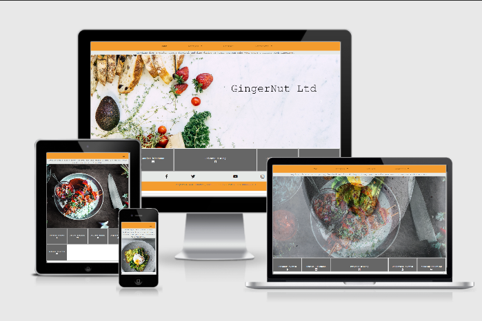

# Catering & Events by Peter Freemantle

## Deployed version

https://sdmusic.github.io/Milestone-Project-1/

## UX

For who this website is created
This Webiste was created for the former Event catering group “GingerNut Catering Ltd”

### At who this website is targeted

This website is targeted at high disposable income individuals and companies  in.between their 30’s and 70’s in the united kingdom, looking for private catering.
Which language is used and why
Though the united kingdom is a multicultural country, the website has been put in English as it is the predominate language.

### What is the goal to achieve with this website

The goal is to provide a concise platform offering information on the services available and provide a marketing platform with contact links are available for information requests and bookings.

### User stories

As a potential event organiser  who has a rough idea of what im looking for I would want to be able to find out where I can sample the offering be able to contact the services provider to ask about the request that I have.
I would also be looking to see images of what was on offer and to keep up to date with any upcoming events I could attend.
It needs to be straight forward so I do not feel out of my depth and be able to see if they have the services I am looking for that would be identifiable after entering the website off a google search.
As a user who already bought the record I want to be able to stream or download the music and listen to it everywhere I want. I'll also want to see the video of the releaseparty and be notified of any future projects.
Mock-ups
The mock-ups for this project are in the UXD folder wich you will find in the root of this project.

Wireframe1
Wireframe2

## Concept

This will be a multiple pages website, home page will be an image carousel showing  the service, product and branded images. A banner with download links underneath with fixed header containing a text banner and navigation bar. Footer will be fixed at the bottom of the page with contact phone numbers and social network links.
The header will keep the banner in both desktop and mobile. In desktop the links will keep across full screen but move to a burger icon when in mobile allowing for the content to be kept clear and visible.
The navigation menu will contain dropdown link allowing for expansion of pages by leading to some of the page pages broken down by id tags. The nav menu will have active screens set allowing the user to know where they are in the site.

The site will be fully responsive and optimized to be viewed on different screen sizes and devices.

## Basic features

* Multiple pages with nav bar to the different pages and sections.
* Sticky top menu, for  easy naviagtion.
* Footer and download Menu with icons for an intuitive design with an alternative for visual impaired people.
* Icons screen.
* Mouse-hover tooltips for icons and links.
* Custom scroll bar for scrolling for recipe page items.
* Carousel on homepage to catch the eye.
* Fully responsive design.
* Burger icon with drop down for smaller screens
* Youtube and google maps embedded in locations page for directions and examples of what is to be seen at the locations.
* Download section for the sample menus.
* Cover-art section to showcase the album-art.
* Footer with credits and links to contributers to both the website as the record.
* Form to contact for further information and requests.
* In this release the form will do nothing but reload the page, as its functionality is out of the scope of this project.
* Optional Features to be implemented later
